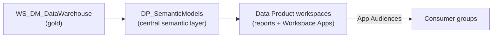

# 5. Platform Architecture (workspace & domain topology)

> `Owner Lead Architect` · `Status proposed` · `Depends on Governance Classes, Operating Model`
>
> **Sprint note:** the back-end tenant/OneLake/medallion architecture is decided and lives in DRS's
> DevOps wiki. This page carries only the **workspace & domain topology** decisions raised in the
> front-end sprint — where semantic models live, how Data Product workspaces are shaped, and how the
> Data Products domain is subdivided.

**Purpose** — set where semantic models live and how Data Product workspaces and sub-domains are shaped.

## The approach

DRS's domain/workspace layout was drawn for **decentralised, data-mesh ownership** — models and data
able to live in many places. In reality DRS works **centrally** all the way up to and including the
semantic models, at least for the well-established data products. Splitting the semantic-model layer
finely therefore adds friction without buying autonomy.

Consolidate the semantic layer into **one central Semantic Models workspace** sitting in natural
extension of the Data Platform gold workspace, keep the Data Product workspaces for **report exhibition
and Workspace Apps**, and use **App Audiences** to differentiate who sees what — so we scale at the
governance seam (access), not by multiplying workspaces.

## Decisions

| Decision | Options | Choice | Why | Status |
|---|---|---|---|---|
| Semantic-model placement | mesh: models per Data Product workspace · **central Semantic Models workspace** (`DP_SemanticModels`, between `WS_DM_DataWarehouse` and the Data Product workspaces) · Other | **central Semantic Models workspace** (Rec. 1) | DRS works centrally up to the semantic layer; fine splitting adds friction without real ownership | proposed |
| Domain home for `DP_SemanticModels` | under **Data Platform** domain · under **Data Products** domain | _open — decide with DRS_ | open question raised in the room; both are defensible | proposed |
| Data Product workspaces | keep for reports + Workspace Apps · dissolve into central | **keep for report exhibition + collecting reports into Workspace Apps** (Rec. 2) | preserves the governance seam; workspace access can still be shared if a real need arises | proposed |
| Content differentiation within a product | per-workspace split · **Workspace App Audiences** | **use App Audiences** to differentiate what is exhibited to whom (Rec. 3) | granular sharing of workspace content without granting workspace access | proposed |
| Data Products sub-domain split | subdomain per entity + DEV/PROD · **DEV/PROD only** | **drop per-entity subdomains; keep only DEV/PROD** (Rec. 4) | no real data ownership per product subdomain — the split is needless complexity | proposed |

### Derived consequences

- **Simpler workspace architecture** and a simpler domain architecture.
- Access to the central semantic models can now only be granted at **item level** — workspace-level
  grants would expose more than a user should see (unless RLS were applied to everything, which it
  won't be). *Whether workspace permissions have ever been used as a sharing mechanism is unconfirmed —
  see the access analysis to-do on [page 10](10-security-access.md).*
- Scaling happens **where it matters — the governance seam**: workspace access can still be shared if a
  genuine need appears.

---
[← 00 How to use](00-how-to-use.md) · [Manifest](../README.md) · [Next: 07 Modelling →](07-transformation-modelling.md)
