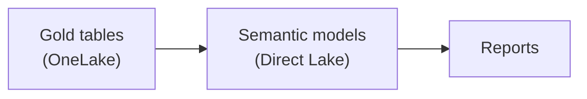

# 7. Transformation & Modelling

> `Owner Lead Architect` · `Status proposed` · `Depends on Architecture`

**Purpose** — decide where logic lives and how semantic models are built on top of the lake.

## The approach

Push transformation into the lake (silver/gold) and keep the semantic layer thin. Build on a **conformed
core** of shared dimensions and facts; let domains extend with composite models rather than re-deriving
the basics. Prefer Direct Lake so models read OneLake without import copies.

## Decisions

| Decision | Options | Choice | Why | Status |
|---|---|---|---|---|
| Modelling approach | A1 import star schemas A2 Direct Lake core; domain composite models A3 per-domain models on a certified core **Other** | _proposed_ | balance reuse against autonomy | proposed |
| Logic location | A1–A3 transform in silver/gold; thin semantic layer **Other** | _proposed_ | one place for logic, not scattered in DAX | proposed |
| Shared dimensions | A1 central A2 conformed core, domains extend A3 domain-published, federated **Other** | _proposed_ | consistency without a bottleneck | proposed |

---
[← 06 Ingestion](06-ingestion.md) · [Manifest](../README.md) · [Next: 08 Serving →](08-semantic-serving.md)
