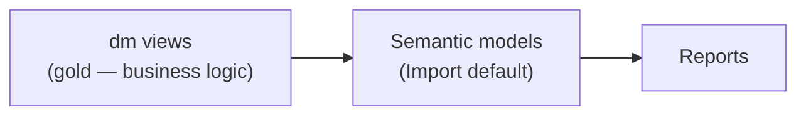

# 7. Transformation & Modelling

> `Owner Lead Architect` · `Status proposed` · `Depends on Architecture`

**Purpose** — decide where logic lives and how semantic models are built on top of the lake.

## The approach

Push transformation into the lake (silver/gold) and keep the semantic layer thin. Models connect to
**`dm` views**, which are allowed — encouraged — to be reused across several models and to hold as much
business logic as possible. If a piece of logic is needed in more than one model, that is the signal to
push it back into a `dm` view rather than duplicate it in DAX. **Import** is the default modelling mode;
**DirectQuery** can make sense on very large tables (full storage-mode order on [page 08](08-semantic-serving.md)).

## Decisions

| Decision | Options | Choice | Why | Status |
|---|---|---|---|---|
| Modelling approach | import star schema on reusable `dm` views · Direct Lake core + composite · per-domain on certified core · **Other** | **import star schema built on reusable `dm` views** | matches DRS's central, well-established products; simple and predictable | proposed |
| Logic location | in `dm`/gold · in semantic model · in report DAX · **Other** | **`dm` views hold as much business logic as possible; thin model; DAX for presentation only** | compute once in the lake, don't scatter across models | proposed |
| Logic-reuse rule | duplicate per model · **push shared logic back into a `dm` view** | **logic needed in >1 model → push it back into a `dm` view** | a `dm` view is reusable; DAX copies drift | proposed |
| `dm` view reuse | one view per model · **shared, reusable views across models** | **reuse `dm` views across multiple models** | conformed logic, one source of truth | proposed |
| Default storage mode | Import · Direct Lake · DirectQuery | **Import (default); DirectQuery for very large tables** | keeps most models simple; DQ only where size demands (see page 08) | proposed |

## Documentation standard

Every semantic model should be documented via:

- **Legible naming** of tables, columns and measures with as few abbreviations as possible.
- **Filled-in description fields** on all tables, columns and measures — descriptions may be
  auto-populated via scripts.
- A **documentation page** in the model's associated `.pbix`/`.pbip`, or alternatively in
  Wiki/SharePoint/OneDrive, covering: owner, contact details, refresh frequency, and a usage guide
  (model contents, do's and don'ts, key-KPI definitions).
- A **hidden tab with Info.View tables** (metadata self-documentation).

---
[← 05 Architecture](05-architecture.md) · [Manifest](../README.md) · [Next: 08 Serving →](08-semantic-serving.md)
