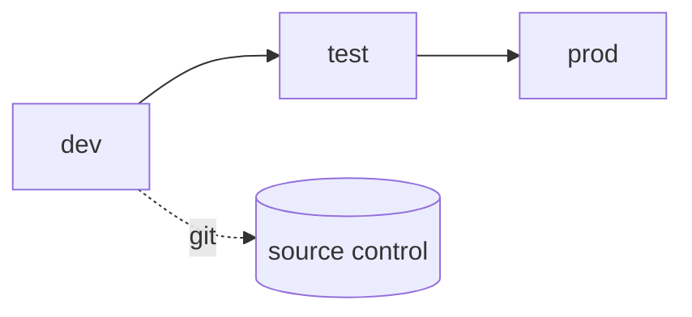

# 9. Engineering & CI/CD

> `Owner Platform Owner` · `Status proposed` · `Depends on Governance Classes`

**Purpose** — set environments, source control, the workspace lifecycle, and the path from idea to production.

## The approach

Separate **dev / test / prod**; business-critical workloads get capacity isolation. Version-control
content and promote through deployment pipelines, with full branch-based git flow where teams are
engineering-capable. Instantiate **workspace-per-(domain × env)** from a template and run a clear
create → archive lifecycle. A light gated intake stamps criticality on each workload.

## Decisions

| Decision | Options | Choice | Why | Status |
|---|---|---|---|---|
| Environments | A1–A3 Pattern 2 (dev/test/prod on shared capacity); business-critical → Pattern 3 (isolated) **Other** | _proposed_ | safe change without over-provisioning | proposed |
| CI/CD | A1 deployment pipelines A2 git integration + deployment pipelines A3 full branch-based git flow **Other** | _proposed_ | rigor tracks engineering maturity | proposed |
| Workspace lifecycle | A1–A3 workspace-per-(domain × env) from template; create → archive lifecycle **Other** | _proposed_ | predictable, automatable provisioning | proposed |
| Solution intake (SDLC) | A1 central gated A2 light gated; intake stamps criticality A3 domain-autonomous with guardrails **Other** | _proposed_ | quality without slowing teams | proposed |

---
[← 08 Serving](08-semantic-serving.md) · [Manifest](../README.md) · [Next: 10 Security →](10-security-access.md)
