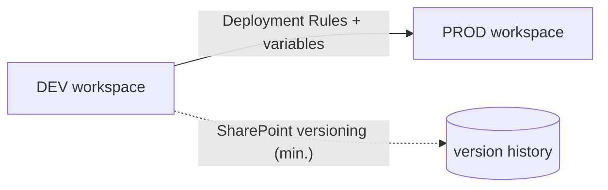

# 9. Engineering & CI/CD

> `Owner Platform Owner` · `Status proposed` · `Depends on Governance Classes`

**Purpose** — set environments, source control, and the promotion path for centrally built front-end work.

> ⚠ **Constraint relaxed vs library default — needs ratification.** The library page 09 requires
> *"production deployments MUST go through source control (no portal-only changes to prod)."* DRS's
> workshop concluded that full git + collaborative-development setup is **overkill** for the front-end
> and that **SharePoint versioning is the accepted minimum**. This page reflects DRS's decision; a
> human must ratify keeping the relaxed constraint above (or restoring the stricter git-gated one).

## The approach

Keep it light: **DEV and PROD** workspaces for everything centrally built (models and reports) — **TEST
is superfluous**. Full git and a collaborative-development setup are overkill; **SharePoint versioning
is the absolute minimum** on everything centrally developed. Promote between environments with
**Deployment Rules and variables** that map DEV and PROD models to the DEV/PROD databases.

## Decisions

| Decision | Options | Choice | Why | Status |
|---|---|---|---|---|
| Environments | DEV/TEST/PROD · **DEV/PROD only** | **DEV and PROD for all centrally built models & reports; TEST superfluous** | fewer stages, less friction for a small team | proposed |
| Version control | full git + collaborative dev · **SharePoint versioning (minimum)** | **git/full collaborative setup is overkill; SharePoint versioning is the absolute minimum on all centrally developed work** | matches the small team's reality (see ⚠ above) | proposed |
| Cross-environment binding | manual rebind · **Deployment Rules + variables** | **Deployment Rules and variables map DEV/PROD models to DEV/PROD databases** | clean, repeatable promotion | proposed |

---
[← 08 Serving](08-semantic-serving.md) · [Manifest](../README.md) · [Next: 10 Security →](10-security-access.md)
