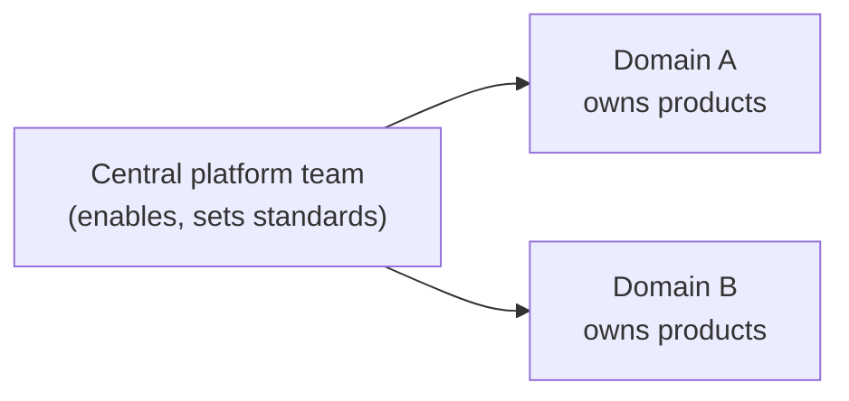

# 2. People & Operating Model

> `Owner Executive Sponsor` · `Status proposed` · `Depends on Strategy`

**Purpose** — set who owns what, who decides, how it's funded, and the roles that run it.

## The approach

The operating model is the single most determinative choice — most later `scope` classifications flow
from it. Decide it, then the funding posture, the decision rights (who decides / approves / arbitrates),
the content-ownership default, and the core roles. Capture decision *authority* here; day-to-day RACI
sits in the roles table.

## Decisions

| Decision | Options | Choice | Why | Status |
|---|---|---|---|---|
| Operating model | A1 centralised A2 federated / hub-and-spoke A3 data mesh **Other** | _proposed_ | determines nearly every downstream scope | proposed |
| Funding | A1 central cost centre A2 showback → chargeback A3 chargeback per domain **Other** | _proposed_ | capacity sizing + FinOps depend on it | proposed |
| Decision rights | A1 central authority A2 CoE + delegated domain authority A3 federated within a thin global standard **Other** | _proposed_ | unclear authority stalls everything | proposed |
| Content ownership | A1 managed self-service + enterprise core A2 managed self-service default; business-led for mature units A3 domain-owned products the norm **Other** | _proposed_ | drives domain design + tooling split | proposed |
| Core roles | A1–A3 five roles: data-product owner · domain admin · platform engineer · steward · consumer **Other** | _proposed_ | shared vocabulary for the RACI | proposed |

## RACI (fill per client)

| Activity | Owner | Approver | Contributor | Informed |
|---|---|---|---|---|
|  |  |  |  |  |

---
[← 01 Strategy](01-strategy.md) · [Manifest](../README.md) · [Next: 03 Governance classes →](03-governance-classes.md)
