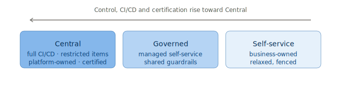

# 3. Governance Classes & Workspace Model

> `Owner Platform Owner` · `Status proposed` · `Depends on Operating Model`

**Purpose** — set the workspace classes that decide the playing rules: which items are allowed, who creates them, and how much rigor applies.

## The approach

This is the **pivotal axis** — decided early, because most later pages key their rules to it. How many
classes branches on the operating model: a centralised, simpler org needs **two** (central + a fenced
self-service); the common case is **three** (central / governed / self-service), where the *governed*
tier brings ungoverned business self-service inside guardrails rather than banning it; a large,
decentralised org may add a fourth **sandbox**.

Rigor rises toward Central along the gradient above — items narrow, CI/CD gates tighten, certification
becomes mandatory, access groups get stricter. The specifics live on their own pages, keyed by class.

## Decisions

| Decision | Options | Choice | Why | Status |
|---|---|---|---|---|
| How many classes | A1 two (central + self-service) A2 three (+ governed) A3 three–four (+ sandbox) **Other** | _proposed_ | the governed tier converts cowboy self-service | proposed |
| Class assignment | A1–A3 one class per workspace, set at creation **Other** | _proposed_ | unambiguous rules per workspace | proposed |
| Rigor gradient | A1 light A2 rising toward central A3 thin global + domain self-gov **Other** | _proposed_ | enforcement tracks ownership | proposed |

## Per-class model

| Dimension | Central | Governed | Self-service | Detailed on |
|---|---|---|---|---|
| Allowed items | narrow | broader | broadest | 03 catalog |
| Creation rights | platform team | domain leads | business | 02 People |
| CI/CD | full gated | lighter gates | optional | 09 Engineering |
| Certification | mandatory | encouraged | not required | 04 Governance |
| Access | tight groups | scoped groups | broad within fence | 10 Security |

---
[← 02 People](02-people-operating-model.md) · [Manifest](../README.md) · [Next: 04 Governance →](04-governance.md)
