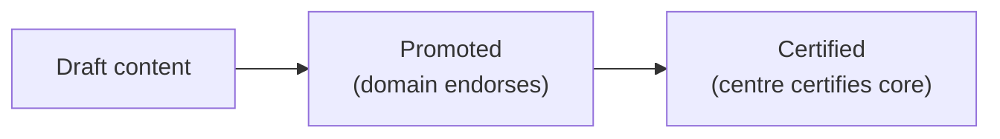

# 4. Governance, Catalog & Quality

> `Owner CoE Lead` · `Status proposed` · `Depends on Governance Classes`

**Purpose** — make data findable and trustworthy: tenant-setting control, the endorsement model, and what "good data" means.

## The approach

Hold the security-sensitive tenant settings central and delegate domain-scoped ones. Make data findable
through a catalog and mark trust through **endorsement** (promoted → certified). Define data quality as a
framework the centre owns and domains apply to their own products.

## Decisions

| Decision | Options | Choice | Why | Status |
|---|---|---|---|---|
| Tenant settings | A1–A3 central baseline; delegate domain-scoped; hold security/sharing/export central **Other** | _proposed_ | safe defaults without blocking delivery | proposed |
| Endorsement model | A1 promoted only A2 promoted + certified (centre certifies the core) A3 domain-certified within standard **Other** | _proposed_ | trust signal scales with autonomy | proposed |
| Data quality | A1 central checks A2 central framework; domains own rules A3 domain-owned DQ + monitoring **Other** | _proposed_ | quality ownership follows product ownership | proposed |
| Catalog / discovery | A1–A3 OneLake catalog + endorsements; Purview when lineage/classification needed **Other** | _proposed_ | findability without premature tooling | proposed |

---
[← 03 Governance classes](03-governance-classes.md) · [Manifest](../README.md) · [Next: 05 Architecture →](05-architecture.md)
