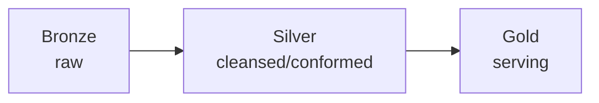

# 5. Platform Architecture

> `Owner Lead Architect` · `Status proposed` · `Depends on Governance Classes, Operating Model`

**Purpose** — set the tenant shape, the OneLake layout, and the landing zone the platform sits in.

## The approach

Default to a **single tenant**; split only on a hard legal/residency wall. Organise OneLake by the
**medallion** pattern (bronze → silver → gold), aligned to domains so units share via shortcuts rather
than copies. Place capacities in a dedicated landing-zone subscription; reach for private endpoints on
sensitive paths.

## Decisions

| Decision | Options | Choice | Why | Status |
|---|---|---|---|---|
| Tenant topology | A1–A3 single tenant; multi-tenant only on a legal/residency wall **Other** | _proposed_ | one tenant unless the law forces otherwise | proposed |
| OneLake layout | A1 central lakehouse, medallion A2 domain-aligned lakehouses, medallion within domain A3 per-domain data products on shared OneLake **Other** | _proposed_ | layout follows ownership | proposed |
| Landing zone & network | A1 default A2 dedicated LZ subscription; private endpoints on sensitive paths A3 + full isolation where regulated **Other** | _proposed_ | isolate the platform without over-locking | proposed |

---
[← 04 Governance](04-governance.md) · [Manifest](../README.md) · [Next: 06 Ingestion →](06-ingestion.md)
