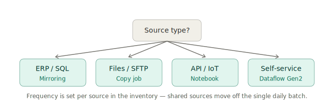
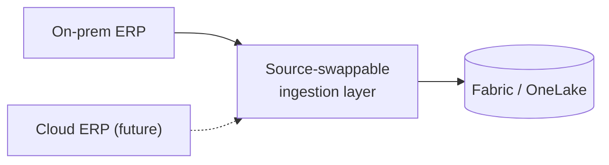

# 6. Ingestion & Data Flow

> `Owner Lead Architect` · `Status proposed` · `Depends on Architecture, Governance Classes`

**Purpose** — map each source to a pattern, at a frequency that serves the business.

## The approach

Ingestion mechanism follows **source type**, shifted by the workspace's **governance class**: ERP and
relational sources mirror; bulk files and SFTP land via copy jobs; APIs and IoT come through notebooks
(or Eventstream for true real-time); self-service sources use Dataflows Gen2.

Load **frequency** is decided per source, not once for the platform. Where users span time zones, shared
sources move off a single daily batch toward incremental / higher-frequency loads. When an ERP migration
is on the horizon, build a **source-swappable** ingestion layer so the cutover is a connection change,
not a rebuild:

## Decisions

| Decision | Options | Choice | Why | Status |
|---|---|---|---|---|
| Pattern per source | A1 Dataflows + pipelines A2 route by source type A3 notebook-first, per-domain **Other** | _proposed_ | match mechanism to source | proposed |
| Load frequency | A1 daily refresh A2 per-source incremental A3 per-domain event-driven **Other** | _proposed_ | cadence follows the consumer | proposed |
| ERP bridge | A1–A3 source-swappable layer ahead of any ERP cloud move **Other** | _proposed_ | survive the ERP cloud move | proposed |
| Real-time | A1 none A2–A3 Eventstream for genuine real-time **Other** | _proposed_ | avoid streaming where batch suffices | proposed |

## Source inventory

One row per source — tooling and frequency are per-source, so ten sources with ten different needs is
just ten rows. Add rows freely.

| Source | Type | Tool | Frequency | Owner | Notes |
|---|---|---|---|---|---|
|  |  |  |  |  |  |

---
[← 05 Architecture](05-architecture.md) · [Manifest](../README.md) · [Next: 07 Modelling →](07-transformation-modelling.md)
