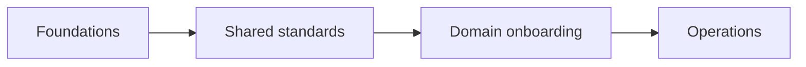

# 14. Roadmap & Migration

> `Owner Platform Owner` · `Status proposed` · `Depends on Strategy, Operating Model`

**Purpose** — sequence the build and plan any migration off legacy.

## The approach

Sequence the rollout in waves: foundations → shared standards → domain onboarding → operations. Domain
onboarding repeats per domain as a standing kit, so each new domain is a fast, templated entry rather
than a project. Where legacy exists, run migration as a parallel track, per source, by criticality.

## Decisions

| Decision | Options | Choice | Why | Status |
|---|---|---|---|---|
| Rollout sequence | A1–A3 foundations → shared standards → domain onboarding → operations **Other** | _proposed_ | each wave feeds the next | proposed |
| Migration approach (if legacy) | A1 lift-and-shift / coexist A2 coexist-then-cutover per source A3 re-platform per domain **Other** | _proposed_ | de-risk by source criticality | proposed |

## Migration tracker (fill if legacy exists)

| Legacy source | Approach | Target | Cutover | Status |
|---|---|---|---|---|
|  |  |  |  |  |

---
[← 13 Enablement](13-enablement-adoption.md) · [Manifest](../README.md)
