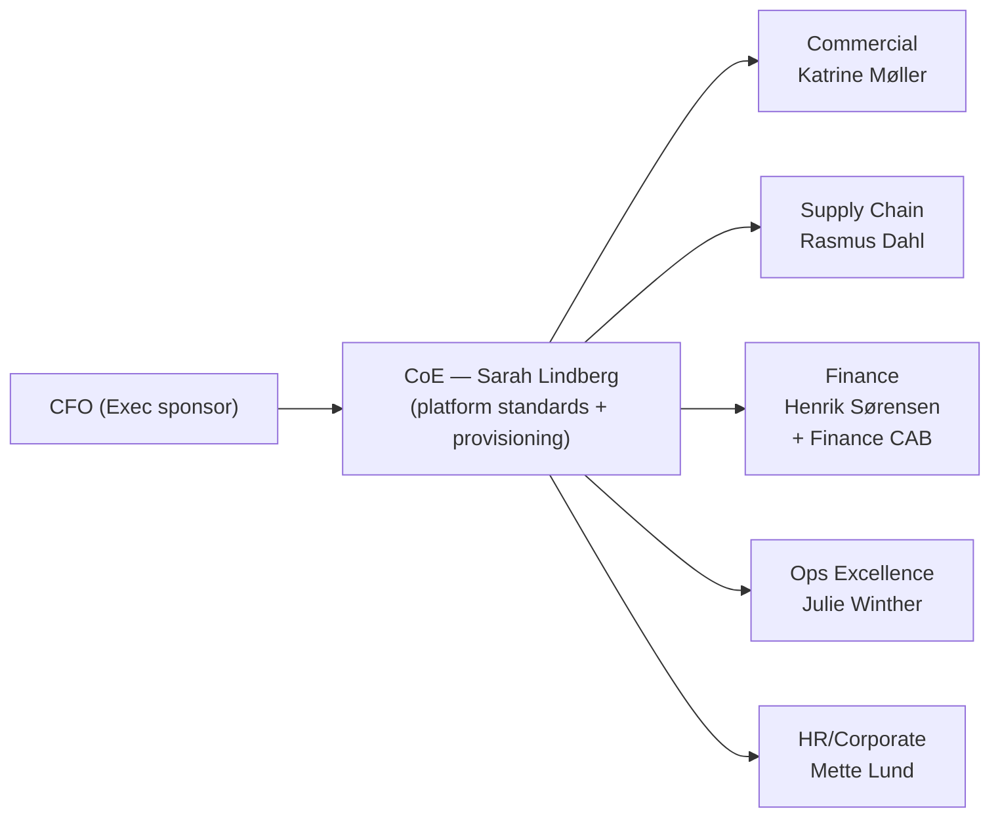

# 2. People & Operating Model

> `Owner Marianne Koch (CFO)` · `Status agreed` · `Depends on Strategy`

**Purpose** — set who owns what, who decides, how it's funded, and the roles that run it.

## The approach

The operating model is the single most determinative choice — most later `scope` classifications flow
from it. For a federated org, decide: how central is the CoE, how much authority do domains get, how
is it funded, and who arbitrates disputes.

Five semi-autonomous business domains, a central CoE, and a CTO-mandated DevOps culture point to
a **federated / hub-and-spoke** model. The CoE (led by Sarah Lindberg) sets standards, provisions
workspaces, and certifies core data products. Domain leads own the products their teams build.
The commercial and supply chain domains are engineering-capable and ready to own their pipelines;
finance, ops, and HR consume what the platform delivers or build within tightly guarded self-service
workspaces.

Finance is a special case. SOX compliance means Finance workspace changes cannot be self-approved —
they route through the **Finance Change Advisory Board (CAB)** chaired by Henrik Sørensen. The CoE
provides technical review but cannot sign off in place of the CAB. This is a constraint, not a
preference, and it is reflected in the CI/CD and engineering pages.

Funding starts as **showback** (wave 1) and transitions to **chargeback** once capacity sizing
is stable (wave 2). The CFO sponsor made cost visibility an explicit outcome (O5) — domain leads
will receive monthly dashboards before chargeback mechanics are activated.

## Decisions

| Decision | Options | Choice | Why | Status |
|---|---|---|---|---|
| Operating model | A1 centralised A2 federated / hub-and-spoke A3 data mesh **Other** | Federated / hub-and-spoke (A2) | 5 semi-autonomous domains; commercial + supply chain ready to own products; CoE enables without becoming the bottleneck | agreed |
| Funding | A1 central cost centre A2 showback → chargeback A3 chargeback per domain **Other** | Showback (wave 1) → chargeback per domain (wave 2) (A2) | outcome O5 requires showback live by wave 2; full chargeback after 6 months of stable sizing | agreed |
| Decision rights | A1 central authority A2 CoE + delegated domain authority A3 federated within a thin global standard **Other** | CoE + delegated domain authority; Finance CAB for SOX-scope changes (A2+constraint) | cross-domain arbitration by CoE; Finance change control is SOX-mandated, not CoE discretion | agreed |
| Content ownership | A1 managed self-service + enterprise core A2 managed self-service default; business-led for mature units A3 domain-owned products the norm **Other** | Business-led for commercial + supply chain; managed self-service for finance, ops, HR (A2) | commercial and supply chain have engineering muscle and named product owners | agreed |
| Core roles | A1–A3 five roles: data-product owner · domain admin · platform engineer · steward · consumer **Other** | Five standard roles (A1–A3) | shared vocabulary for the RACI | agreed |

## RACI

| Activity | Owner | Approver | Contributor | Informed |
|---|---|---|---|---|
| Workspace provisioning | Thomas Bak (Platform eng.) | CoE Lead | Domain admin | Domain lead |
| Data product publication (non-Finance) | Data-product owner | Domain admin | Steward | CoE Lead |
| Finance workspace change | Henrik Sørensen | Finance CAB | Thomas Bak | CoE Lead |
| Tenant settings change | CoE Lead | Anders Holm (Head of IT) | Thomas Bak | All domain leads |
| CI/CD deployment to prod (non-Finance) | Thomas Bak | CoE Lead | Domain admin | Domain lead |
| CI/CD deployment to Finance prod | Thomas Bak | Finance CAB + CoE Lead | Henrik Sørensen | Marianne Koch |
| Sensitivity label policy change | CoE Lead | Anders Holm | Thomas Bak | All domain leads |
| Capacity sizing review (monthly) | CoE Lead | Anders Holm | Thomas Bak | All domain leads + CFO |
| SSAS cube retirement sign-off | Domain lead | CoE Lead + Finance CAB | Thomas Bak | Marianne Koch |
| New domain onboarding | CoE Lead | Anders Holm | Thomas Bak | Domain lead |

---
[← 01 Strategy](01-strategy.md) · [Manifest](../README.md) · [Next: 03 Governance classes →](03-governance-classes.md)
