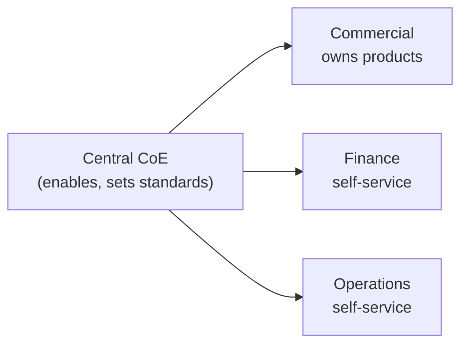

# 2. People & Operating Model

> `Owner Executive Sponsor` · `Status agreed` · `Depends on Strategy`

**Purpose** — set who owns what, who decides, how it's funded, and the roles that run it.

## The approach

The operating model is the single most determinative choice — most later `scope` classifications flow
from it. Decide it, then the funding posture, the decision rights (who decides / approves / arbitrates),
the content-ownership default, and the core roles. Capture decision *authority* here; day-to-day RACI
sits in the roles table.

The mix of a central BI team and semi-autonomous global business units maps naturally to a **federated /
hub-and-spoke** model. The commercial domain is engineering-capable and ready to own its own products;
finance and operations consume central outputs via managed self-service. The central team (CoE) sets
standards and unblocks — it does not become the pipeline for all delivery.

## Decisions

| Decision | Options | Choice | Why | Status |
|---|---|---|---|---|
| Operating model | A1 centralised A2 federated / hub-and-spoke A3 data mesh **Other** | Federated / hub-and-spoke (A2) | central BI team + semi-autonomous units; commercial ready to own products | agreed |
| Funding | A1 central cost centre A2 showback → chargeback A3 chargeback per domain **Other** | Showback initially; move to chargeback in wave 2 (A2) | exec sponsor wants cost visibility; chargeback deferred until capacity sizing is stable | agreed |
| Decision rights | A1 central authority A2 CoE + delegated domain authority A3 federated within a thin global standard **Other** | CoE + delegated domain authority (A2) | CoE arbitrates cross-domain; domains decide within guardrails | agreed |
| Content ownership | A1 managed self-service + enterprise core A2 managed self-service default; business-led for mature units A3 domain-owned products the norm **Other** | Managed self-service default; commercial domain business-led (A2) | commercial has engineering muscle; finance + operations need guardrails | agreed |
| Core roles | A1–A3 five roles: data-product owner · domain admin · platform engineer · steward · consumer **Other** | Five standard roles (A1–A3) | shared vocabulary for the RACI | agreed |

## RACI (fill per client)

| Activity | Owner | Approver | Contributor | Informed |
|---|---|---|---|---|
| Workspace provisioning | Platform engineer | CoE Lead | Domain admin | — |
| Data product publication | Data-product owner | Domain admin | Steward | CoE Lead |
| Tenant settings change | CoE Lead | Executive Sponsor | Platform engineer | — |
| CI/CD deployment to prod | Platform engineer | CoE Lead | Domain admin | — |

---
[← 01 Strategy](01-strategy.md) · [Manifest](../README.md) · [Next: 03 Governance classes →](03-governance-classes.md)
