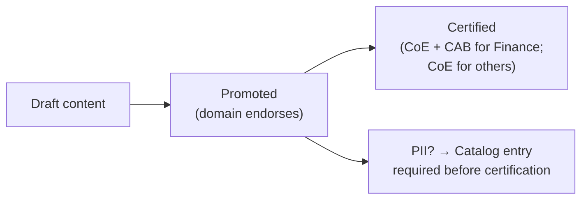

# 4. Governance, Catalog & Quality

> `Owner Sarah Lindberg (CoE Lead)` · `Status agreed` · `Depends on Governance Classes`

**Purpose** — make data findable and trustworthy: tenant-setting control, the endorsement model, and what "good data" means.

## The approach

Hold security-sensitive tenant settings central and delegate domain-scoped ones. Make data findable
through a catalog and mark trust through **endorsement** (promoted → certified). Define data quality
as a framework the centre owns and domains apply to their own products.

Two regulatory obligations add structure here that a typical A2 client would not have.

**SOX (Finance):** Finance data products must carry the `Finance-SOX` sensitivity label before
they can be promoted. Certification of Finance content requires CoE review *and* Finance CAB sign-off
— the domain admin alone cannot certify. The endorsement flow is unchanged structurally, but the
approval chain is longer. Any dataset in the Finance domain that feeds a report used in the Group
P&L or regulatory filings is subject to this constraint. Henrik Sørensen owns the Finance-SOX
label policy.

**GDPR (Commercial + HR):** Any dataset containing EU customer PII (from the commercial SQL Server
or Salesforce) or employee PII (from Workday) must have a lineage entry in the catalog *before* it
can be certified. Certification is the gate, not a retrospective label. The catalog entry must
include the PII classification, the legal basis, and the retention period. The CoE holds the catalog;
domains register their PII assets on first promotion.

Data quality is a central framework — the CoE defines what "quality" means, domain by domain — but
domains own the rules and the remediation. Finance's quality rules centre on GL reconciliation
tolerance (±DKK 10k per period). Commercial's focus is customer master completeness (mandatory
fields on all 5,200 customer records before they enter the conformed core). Supply chain quality is
SLA-driven: latency and completeness of the IoT stream.

## Decisions

| Decision | Options | Choice | Why | Status |
|---|---|---|---|---|
| Tenant settings | A1–A3 central baseline; delegate domain-scoped; hold security/sharing/export central **Other** | Central baseline; export and external sharing locked centrally; delegate workspace-level settings only (A1–A3, tightened) | GDPR and SOX make export/sharing controls non-negotiable at the central level | agreed |
| Endorsement model | A1 promoted only A2 promoted + certified (centre certifies the core) A3 domain-certified within standard **Other** | Promoted + certified; Finance requires CAB co-approval (A2+constraint) | visible trust signal; SOX adds an approval layer on top of standard CoE certification | agreed |
| Data quality | A1 central checks A2 central framework; domains own rules A3 domain-owned DQ + monitoring **Other** | Central framework with domain-owned rules; CoE holds the rule register (A2) | Finance GL reconciliation, commercial customer master, supply chain IoT latency — each domain has different DQ needs | agreed |
| Catalog / discovery | A1–A3 OneLake catalog + endorsements; Purview when lineage/classification needed **Other** | OneLake catalog + Purview for PII lineage and classification (A1–A3 + GDPR enforcement) | GDPR constraint makes Purview lineage non-optional for PII assets | agreed |

## Data quality rule register (seed — expand per domain)

| Domain | Rule | Threshold | Owner | Frequency |
|---|---|---|---|---|
| Finance | GL reconciliation: gold fact vs. source controlling DB | Variance ≤ DKK 10k per period | Henrik Sørensen | Daily |
| Commercial | Customer master completeness: mandatory fields on all records | 100% of 5,200 records | Katrine Møller | Weekly |
| Commercial | PII catalog registration before certification | 0 uncatalogued PII datasets at certification | CoE Lead | At promotion |
| Supply chain | IoT stream completeness: events received vs. expected per vehicle | ≥ 98% per vehicle per hour | Rasmus Dahl | Hourly |
| Supply chain | IoT latency: event age at dashboard load | ≤ 30 min | Rasmus Dahl | Continuous |

---
[← 03 Governance classes](03-governance-classes.md) · [Manifest](../README.md) · [Next: 05 Architecture →](05-architecture.md)
