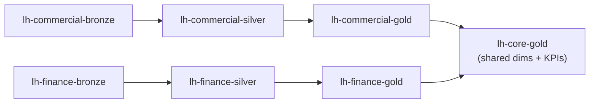

# 5. Platform Architecture

> `Owner Lead Architect` · `Status agreed` · `Depends on Governance Classes, Operating Model`

**Purpose** — set the tenant shape, the OneLake layout, and the landing zone the platform sits in.

## The approach

Default to a **single tenant**; split only on a hard legal/residency wall. Organise OneLake by the
**medallion** pattern (bronze → silver → gold), aligned to domains so units share via shortcuts rather
than copies. Place capacities in a dedicated landing-zone subscription; reach for private endpoints on
sensitive paths.

The domain alignment in OneLake maps to the three business units: commercial, finance, and operations
each own their domain lakehouses. Shared conformed dimensions and cross-domain KPIs live in a central
gold lakehouse accessed via shortcuts — no copies. This layout supports the APAC/US reporting need:
incremental loads per domain land independently, no global batch gate.

## Decisions

| Decision | Options | Choice | Why | Status |
|---|---|---|---|---|
| Tenant topology | A1–A3 single tenant; multi-tenant only on a legal/residency wall **Other** | Single tenant (A1–A3) | global footprint on one tenant; no residency mandate requiring a split | agreed |
| OneLake layout | A1 central lakehouse, medallion A2 domain-aligned lakehouses, medallion within domain A3 per-domain data products on shared OneLake **Other** | Domain-aligned lakehouses, medallion within domain (A2) | three semi-autonomous units; domains share via shortcuts, not copies | agreed |
| Landing zone & network | A1 default A2 dedicated LZ subscription; private endpoints on sensitive paths A3 + full isolation where regulated **Other** | Dedicated LZ subscription; private endpoints on ERP connection (A2) | isolate the platform; ERP source path is sensitive | agreed |

---
[← 04 Governance](04-governance.md) · [Manifest](../README.md) · [Next: 06 Ingestion →](06-ingestion.md)
