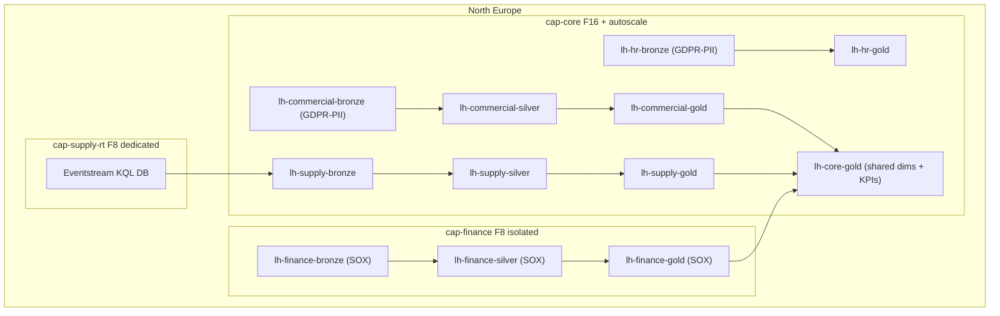

# 5. Platform Architecture

> `Owner Thomas Bak (Lead Architect)` · `Status agreed` · `Depends on Governance Classes, Operating Model`

**Purpose** — set the tenant shape, the OneLake layout, and the landing zone the platform sits in.

## The approach

Single tenant, medallion pattern (bronze → silver → gold), domain-aligned lakehouses, dedicated
landing-zone subscription, private endpoints on sensitive data paths. The standard A2 layout — until
two constraints force specific decisions: **GDPR** and **Finance isolation**.

**GDPR data residency:** EU customer PII (commercial domain) and employee PII (HR domain) must not
land outside EU. All capacities are provisioned in North Europe. The commercial and HR bronze
lakehouses must be tagged as GDPR-PII in the catalog before any data lands. No cross-region
replication of these lakehouses.

**Finance isolation:** The Finance production lakehouse sits on a dedicated F8 capacity (cap-finance),
isolated from the core/commercial/supply capacity. SOX requires a clear audit boundary — Finance data
cannot comingle with other domains at the storage layer. Shortcuts from other domains into Finance
gold are explicitly prohibited; the flow is one-way (Finance gold → core gold for cross-domain KPIs,
via a CoE-managed pipeline with full change control).

**IoT / Eventstream path:** The Kafka fleet-tracking stream (~40k events/hr, ~1,200 vehicles) enters
via Eventstream on the Central class supply chain workspace. It lands in an Eventstream KQL database;
a downstream notebook transforms and loads into the supply chain silver lakehouse on a 5-minute
micro-batch. This keeps the real-time path separate from the bulk-load path.

## Decisions

| Decision | Options | Choice | Why | Status |
|---|---|---|---|---|
| Tenant topology | A1–A3 single tenant; multi-tenant only on a legal/residency wall **Other** | Single tenant (A1–A3) | no residency wall requiring a split; GDPR handled at capacity + labelling layer | agreed |
| OneLake layout | A1 central lakehouse, medallion A2 domain-aligned lakehouses, medallion within domain A3 per-domain data products on shared OneLake **Other** | Domain-aligned lakehouses, medallion within domain; Finance isolated on dedicated capacity (A2 + SOX constraint) | 5 semi-autonomous domains; Finance boundary required for SOX audit; domains share via shortcuts | agreed |
| Landing zone & network | A1 default A2 dedicated LZ subscription; private endpoints on sensitive paths A3 + full isolation where regulated **Other** | Dedicated LZ subscription; private endpoints on Infor ION and Finance SQL Server paths (A2) | most sensitive data paths are ERP and Finance; isolate these, leave others on VNet integration | agreed |

---
[← 04 Governance](04-governance.md) · [Manifest](../README.md) · [Next: 06 Ingestion →](06-ingestion.md)
