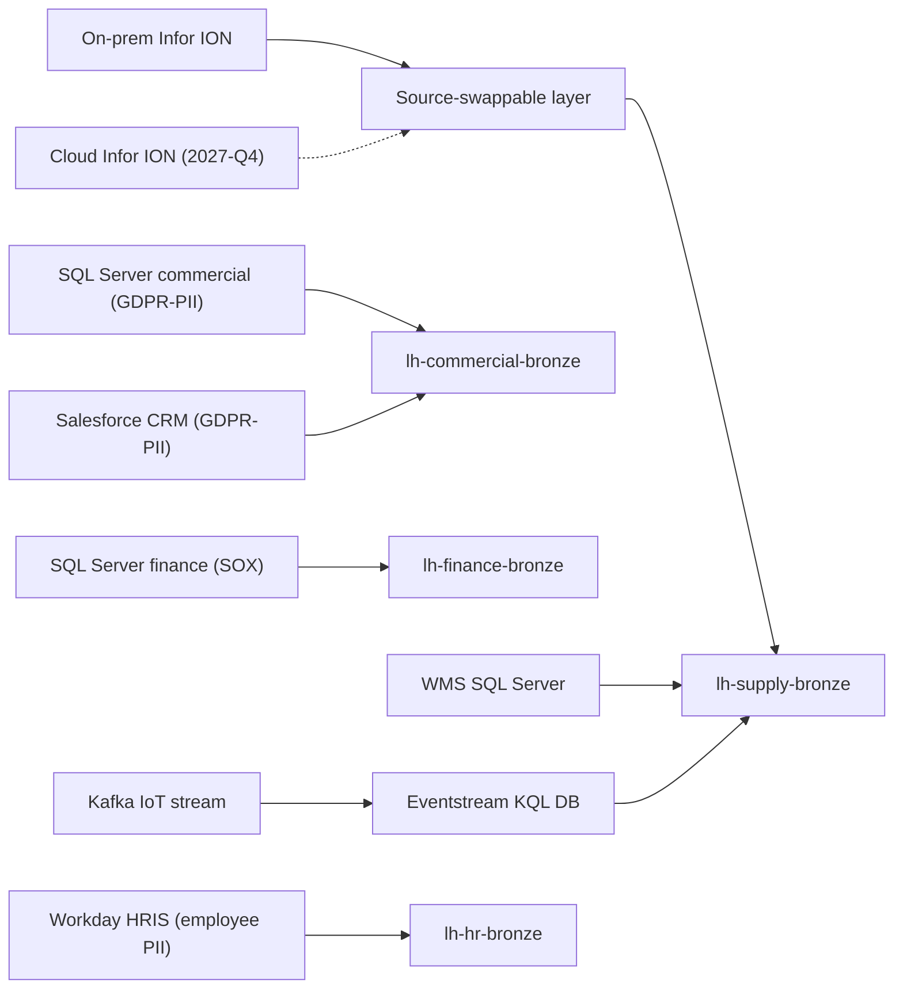

# 6. Ingestion & Data Flow

> `Owner Thomas Bak (Lead Architect)` · `Status agreed` · `Depends on Architecture, Governance Classes`

**Purpose** — map each of the eight sources to a pattern and frequency that serve the business, with the Infor ION cloud move and GDPR scope accounted for from the start.

## The approach

Ingestion mechanism follows **source type**, shifted by the workspace's **governance class**. Eight
sources split into four categories: relational batch (Infor ION, three SQL Servers, WMS), API pull
(Salesforce CRM, Workday HRIS), streaming real-time (Kafka IoT fleet tracking), and file/manual
(Excel HR reports, being retired in wave 2).

Three constraints shape the design beyond standard pattern-routing.

**Source-swappability (Infor ION):** The 2027-Q4 cloud migration is a hard deadline. The ingestion
layer abstracts the source: a `conn-erp-prod` connection record is the only thing that changes at
cutover. This must be validated in wave 2, not wave 3. Thomas Bak owns the swappable-layer design.

**GDPR tagging:** The commercial SQL Server and Salesforce carry EU customer PII; Workday carries
employee PII. Each pipeline targeting these sources must tag its destination lakehouse GDPR-PII
before the first data load. Provisioning gate — not retrospective.

**Finance change control:** Ingestion pipelines targeting the Finance SQL Server are SOX scope.
Pipeline changes require Finance CAB approval before reaching the test environment. Thomas Bak
coordinates with Henrik Sørensen on every Finance ingestion change.

**IoT / real-time:** The Kafka fleet-tracking stream (~40k events/hr, ~1,200 vehicles, ~6 GB/day)
enters via Eventstream on cap-supply-rt. Eventstream KQL database is the landing zone; a 5-minute
micro-batch notebook loads silver. Business requirement: dashboard latency ≤ 30 min (outcome O1).

## Decisions

| Decision | Options | Choice | Why | Status |
|---|---|---|---|---|
| Pattern per source | A1 Dataflows + pipelines A2 route by source type A3 notebook-first, per-domain **Other** | Route by source type (A2): pipelines for relational, notebooks for API, Eventstream for Kafka IoT, Dataflows Gen2 for HR | match mechanism to source; Eventstream only where genuinely real-time | agreed |
| Load frequency | A1 daily refresh A2 per-source incremental A3 per-domain event-driven **Other** | Per-source incremental (A2) — see source inventory | single daily CET batch underserves APAC/AU/US; each source runs at the frequency its consumers need | agreed |
| ERP bridge | A1–A3 source-swappable layer ahead of any ERP cloud move **Other** | Source-swappable layer on Infor ION (A1–A3) | 2027-Q4 deadline; validated in wave 2 | agreed |
| Real-time | A1 none A2–A3 Eventstream for genuine real-time **Other** | Eventstream for Kafka IoT fleet tracking only (A2–A3) | only source that justifies real-time infrastructure; all others are incremental batch | agreed |

## Source inventory

| Source | Type | Tool | Frequency | Class | GDPR | Owner | Notes |
|---|---|---|---|---|---|---|---|
| Infor ION ERP (on-prem) | ERP / relational | Pipeline (source-swappable layer) | Incremental, 4×/day | Governed → lh-supply-bronze | No | Thomas Bak | Hard deadline: source-swap validated wave 2 before 2027-Q4 |
| SQL Server — commercial DB | Relational | Pipeline | Incremental, hourly | Governed → lh-commercial-bronze | **Yes — EU PII** | Katrine Møller | Orders, pricing, contacts; GDPR tag before first load |
| SQL Server — warehouse ops DB | Relational | Pipeline | Incremental, every 30 min | Central → lh-supply-bronze | No | Rasmus Dahl | WMS backend; near-real-time SLA for O1 |
| SQL Server — finance/controlling | Relational | Pipeline | Incremental, 4×/day; full refresh at month-end | Central → lh-finance-bronze | No | Henrik Sørensen | SOX scope; Finance CAB approval on all changes |
| Salesforce Sales Cloud | REST API | Notebook (incremental) | Daily | Governed → lh-commercial-bronze | **Yes — EU PII** | Katrine Møller | Customer accounts, opportunities; GDPR tag before first load |
| Kafka IoT fleet tracking | Streaming | Eventstream (KQL DB → micro-batch) | Real-time; 5-min micro-batch to silver | Central → lh-supply-bronze | No | Rasmus Dahl | ~1,200 vehicles, ~40k events/hr, ~6 GB/day; drives outcome O1 |
| Workday HRIS | REST API | Dataflow Gen2 | Daily | Self-service → lh-hr-bronze | **Yes — employee PII** | Mette Lund | Headcount, org structure; GDPR tag before first load |
| Excel HR reports | File / manual | Dataflow Gen2 | Monthly (retiring wave 2) | Self-service → lh-hr-bronze | No | Mette Lund | Bridge until Workday API covers all HR reporting needs |

---
[← 05 Architecture](05-architecture.md) · [Manifest](../README.md) · [Next: 07 Modelling →](07-transformation-modelling.md)
