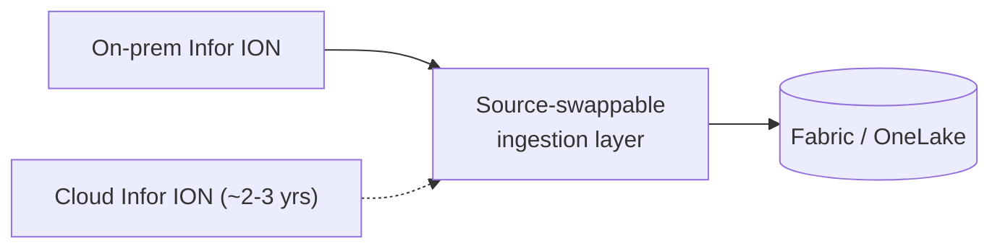

# 6. Ingestion & Data Flow

> `Owner Lead Architect` · `Status agreed` · `Depends on Architecture, Governance Classes`

**Purpose** — map each source to a pattern, at a frequency that serves the business, ahead of the Infor ION cloud move.

## The approach

Ingestion mechanism follows **source type**, shifted by the workspace's **governance class** — the routing
above. Two of this client's headline pains live here. The **once-daily CET load** underserves APAC and US
users, so shared sources move to **incremental / higher-frequency** loads. And the **Infor ION cloud move**
(~2–3 years) means ingestion must be **source-swappable** now, so the cutover is a connection change rather
than a rebuild:

## Decisions

| Decision | Options | Choice | Why | Status |
|---|---|---|---|---|
| Pattern per source | A1 Dataflows + pipelines A2 route by source type A3 notebook-first, per-domain **Other** | Route by source type (A2) | matches source characteristics; keeps platform team off plumbing | agreed |
| Load frequency | A1 daily refresh A2 per-source incremental A3 per-domain event-driven **Other** | Per-source; shared sources off the CET batch (A2) | APAC/US underserved by one morning load | agreed |
| ERP bridge | A1–A3 source-swappable layer ahead of any ERP cloud move **Other** | Source-swappable layer now | Infor ION moves to cloud ~2–3 yrs | agreed |
| Real-time | A1 none A2–A3 Eventstream for genuine real-time **Other** | Eventstream for telematics only | batch suffices elsewhere | agreed |

## Source inventory

| Source | Type | Tool | Frequency | Owner | Notes |
|---|---|---|---|---|---|
| Infor ION ERP (on-prem) | ERP | Mirroring | 4×/day → near-real-time post-cloud | Lead arch | source-swappable; cloud move ~2 yr |
| Legacy SSAS cube / MDS | SQL | Copy job | daily | Data eng | retire after migration |
| Carrier rate APIs (×3) | API | Notebook | hourly | Data eng | rate-limited; incremental pulls |
| Warehouse telematics / IoT | IoT | Eventstream | streaming | Platform | feeds real-time ops dashboards |
| Master data exports (MDM) | Files / SFTP | Copy job | daily | Data eng | bridge until MDM lands in Fabric |
| Finance GL extracts | Files / SFTP | Copy job | daily; hourly at month-end | Finance BI | governed workspace |
| Salesforce CRM | API | Connector / mirroring | 6×/day | Analyst (governed) | |
| APAC regional sales | Self-service | Dataflow Gen2 | daily | Superuser | fenced self-service; was a "cowboy" source |

---
[← 05 Architecture](05-architecture.md) · [Manifest](../README.md) · [Next: 07 Modelling →](07-transformation-modelling.md)
