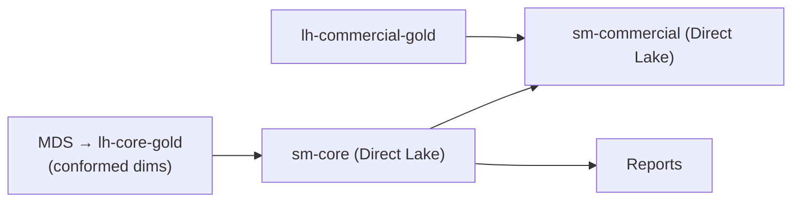

# 7. Transformation & Modelling

> `Owner Lead Architect` · `Status agreed` · `Depends on Architecture`

**Purpose** — decide where logic lives and how semantic models are built on top of the lake.

## The approach

Push transformation into the lake (silver/gold) and keep the semantic layer thin. Build on a **conformed
core** of shared dimensions and facts; let domains extend with composite models rather than re-deriving
the basics. Prefer Direct Lake so models read OneLake without import copies.

The migration from the SSAS cube is the central modelling project. The cube's logic moves into gold-layer
SQL — not into DAX. The semantic model becomes a thin Direct Lake layer on top. The MDS-managed master
data (customers, products, locations) graduates into the conformed gold lakehouse and becomes the shared
dimension set all three domain models reference.

## Decisions

| Decision | Options | Choice | Why | Status |
|---|---|---|---|---|
| Modelling approach | A1 import star schemas A2 Direct Lake core; domain composite models A3 per-domain models on a certified core **Other** | Direct Lake core; domain composite models (A2) | SSAS replacement goes Direct Lake; commercial domain extends via composite | agreed |
| Logic location | A1–A3 transform in silver/gold; thin semantic layer **Other** | Transform in silver/gold; thin semantic layer (A1–A3) | cube logic moves into gold SQL, not into DAX | agreed |
| Shared dimensions | A1 central A2 conformed core, domains extend A3 domain-published, federated **Other** | Conformed core (MDS successor), domains extend (A2) | MDS master data becomes the conformed core; prevents dimension proliferation | agreed |

---
[← 06 Ingestion](06-ingestion.md) · [Manifest](../README.md) · [Next: 08 Serving →](08-semantic-serving.md)
