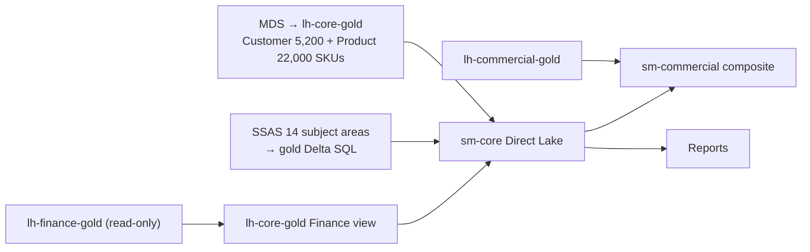

# 7. Transformation & Modelling

> `Owner Thomas Bak (Lead Architect)` · `Status agreed` · `Depends on Architecture`

**Purpose** — decide where logic lives and how semantic models are built on top of the lake.

## The approach

Push transformation into the lake (silver/gold) and keep the semantic layer thin. Build on a **conformed
core** of shared dimensions and facts; let domains extend with composite models. Prefer Direct Lake so
models read OneLake without import copies.

The migration from the SSAS Tabular cube (14 subject areas, ~180 measures) is the central modelling
project in wave 2. Thomas Bak is cataloguing all subject areas before the first wave 2 sprint —
migration without a catalogue produces half-finished transitions that run for two years. Business
logic moves into gold-layer Delta SQL. DAX is restricted to presentation-layer calculations.

The MDS customer master (5,200 customers) and product master (22,000 SKUs) graduate into
`lh-core-gold` in wave 1, becoming the **conformed dimensions** all analytical domains reference.
This eliminates the current proliferation of slightly-different customer attributes across domain models.

Finance gold tables are read-only to all workspaces outside the Finance domain. Cross-domain KPI
reports access Finance data through a CoE-managed view in `lh-core-gold`, not via direct shortcuts.

## Decisions

| Decision | Options | Choice | Why | Status |
|---|---|---|---|---|
| Modelling approach | A1 import star schemas A2 Direct Lake core; domain composite models A3 per-domain models on a certified core **Other** | Direct Lake core; domain composite models (A2) | SSAS replacement goes Direct Lake; commercial extends via composite; import only for small Finance reporting models where Direct Lake is not viable | agreed |
| Logic location | A1–A3 transform in silver/gold; thin semantic layer **Other** | Transform in silver/gold; thin semantic layer (A1–A3) | cube logic moves into gold Delta SQL, not into DAX; DAX is presentation-layer only | agreed |
| Shared dimensions | A1 central A2 conformed core, domains extend A3 domain-published, federated **Other** | Conformed core from MDS successor (customer + product master), domains extend via composite (A2) | MDS data becomes the anchor; prevents 3× slightly-different customer dimension definitions | agreed |

## SSAS cube migration catalogue (Thomas Bak owns — seed list)

| Subject area | Measures (#) | Key consumers | Wave | Migration target | Status |
|---|---|---|---|---|---|
| Sales performance | 28 | Commercial (Katrine M.) | 2 | sm-commercial Direct Lake | proposed |
| Freight margin | 22 | Commercial + Finance | 2 | sm-commercial + sm-core | proposed |
| Warehouse utilisation | 18 | Supply chain (Rasmus D.) | 2 | sm-supply Direct Lake | proposed |
| Finance P&L | 31 | Finance (Henrik S.) + CFO | 2 | sm-finance Direct Lake | proposed |
| Customer profitability | 19 | Commercial | 2 | sm-commercial | proposed |
| Headcount & costs | 14 | HR + Finance | 3 | sm-hr Direct Lake | proposed |
| Fleet & route analytics | 16 | Supply chain | 2 | sm-supply | proposed |
| SLA & ops KPIs | 12 | Ops (Julie W.) | 2 | sm-ops Direct Lake | proposed |
| Product master / SKU analytics | 11 | Commercial + Supply | 2 | sm-core | proposed |
| Cross-domain group KPIs | 9 | CFO, all domain leads | 2 | sm-core | proposed |

---
[← 06 Ingestion](06-ingestion.md) · [Manifest](../README.md) · [Next: 08 Serving →](08-semantic-serving.md)
