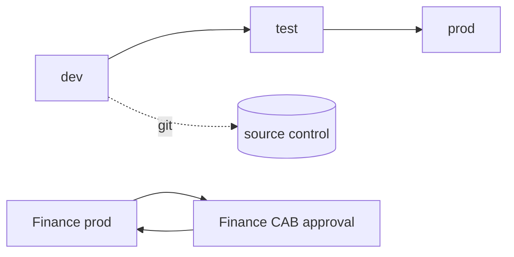

# 9. Engineering & CI/CD

> `Owner Anders Holm (Head of IT)` · `Status agreed` · `Depends on Governance Classes`

**Purpose** — set environments, source control, the workspace lifecycle, and the path from idea to production.

## The approach

Separate **dev / test / prod**; business-critical workloads get capacity isolation. Version-control
content and promote through deployment pipelines. Instantiate **workspace-per-(domain × env)** from
a template and run a clear create → archive lifecycle. A light gated intake stamps criticality on
each workload.

DevOps and version control are a **stated hard requirement from the CTO (Anders Holm)**. Git integration
is on from day one for all Central and Governed workspaces — no exceptions. The commercial and supply
chain domains, being engineering-capable, run full branch-based git flow from the start. Finance, ops,
and HR use deployment pipelines with lighter gates and graduate into full git flow as maturity builds.

**Finance CI/CD** is the special case. SOX requires that Finance production changes are approved by the
Finance CAB before deployment, not just by the CoE. The CAB meets every two weeks; pipeline changes
that miss a CAB window wait for the next one. This means Finance release cycles are bi-weekly at
minimum, not continuous. Thomas Bak coordinates Finance deployments with Henrik Sørensen. The
branching model for Finance uses release branches (not feature-directly-to-main) to batch changes
into CAB-reviewed releases.

**Workspace lifecycle:** All workspaces are provisioned via the `new-workspace.ps1` template script
(Thomas Bak owns it). The script applies the correct governance-class tag, Entra group bindings,
git integration settings, and sensitivity label defaults at creation time. No manual portal configuration.

## Decisions

| Decision | Options | Choice | Why | Status |
|---|---|---|---|---|
| Environments | A1–A3 Pattern 2 (dev/test/prod on shared capacity); business-critical → Pattern 3 (isolated) **Other** | dev/test/prod; Finance prod + supply chain IoT pipeline → isolated capacity (A1–A3) | Finance SOX audit boundary + supply chain reliability requirement both mandate isolation | agreed |
| CI/CD | A1 deployment pipelines A2 git integration + deployment pipelines A3 full branch-based git flow **Other** | Git integration + deployment pipelines; commercial + supply chain → full branch-based git flow; Finance → release branches with CAB gate (A2+ with SOX constraint) | CTO mandate; commercial and supply chain start at full git flow; Finance uses release branches | agreed |
| Workspace lifecycle | A1–A3 workspace-per-(domain × env) from template; create → archive lifecycle **Other** | workspace-per-(domain × env) from template via new-workspace.ps1 (A1–A3) | predictable, repeatable provisioning; script applies class, groups, git, labels at creation | agreed |
| Solution intake (SDLC) | A1 central gated A2 light gated; intake stamps criticality A3 domain-autonomous with guardrails **Other** | Light gated; intake stamps criticality + Finance flag (A2) | standard workloads flow fast; Finance flag triggers CAB routing automatically | agreed |

## Finance deployment cadence

| Step | Who | When |
|---|---|---|
| Feature branch created | Domain dev | Any time |
| PR raised to release branch | Domain dev | Any time |
| CoE code review | Thomas Bak | Within 2 business days |
| CAB change request submitted | Henrik Sørensen | Before CAB meeting |
| Finance CAB approval | Finance CAB | Bi-weekly |
| Deployment to Finance prod | Thomas Bak | Post-CAB, same day |
| Post-deploy sign-off | Henrik Sørensen + CoE Lead | Within 24h |

---
[← 08 Serving](08-semantic-serving.md) · [Manifest](../README.md) · [Next: 10 Security →](10-security-access.md)
