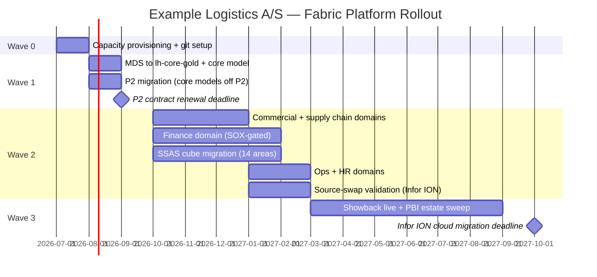
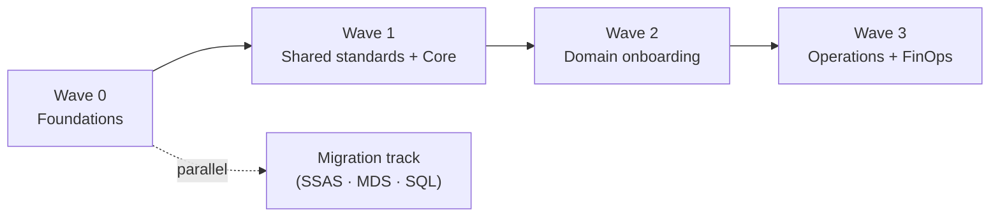

# 14. Roadmap & Migration

> `Owner Anders Holm (Head of IT)` · `Status agreed` · `Depends on Strategy, Operating Model`

**Purpose** — sequence the build and plan any migration off legacy.

## The approach

Sequence the rollout in waves: foundations → shared standards → domain onboarding → operations.
Domain onboarding repeats per domain as a standing kit. Migration runs in parallel as a separate track,
per source, by criticality.

Two external deadlines compress the wave design: the **P2 contract renewal (September 2026)** and
the **Infor ION cloud migration (2027-Q4)**. Wave 0 and wave 1 must land before September 2026;
wave 2 must validate the source-swappable ERP layer before 2027-Q4. Everything else is sequenced
around these two anchors.

MDS master data moves to `lh-core-gold` in wave 1 — it is the anchor for the conformed dimension
layer and must be live before domain models are built on top of it. The SSAS cube retirement is
blocked until all 14 subject areas have a Direct Lake replacement certified (page 08 constraint).

## Decisions

| Decision | Options | Choice | Why | Status |
|---|---|---|---|---|
| Rollout sequence | A1–A3 foundations → shared standards → domain onboarding → operations **Other** | foundations → shared standards → domain onboarding → operations (A1–A3) | each wave feeds the next; MDS must be in core-gold before domain models start | agreed |
| Migration approach (if legacy) | A1 lift-and-shift / coexist A2 coexist-then-cutover per source A3 re-platform per domain **Other** | Coexist-then-cutover per source (A2) | SSAS, MDS, SQL Server, Excel HR de-risked individually; Infor ION cloud move is independent | agreed |

## Wave plan

| Wave | Period | Deliverables | Hard gates |
|---|---|---|---|
| 0 — Foundations | Jul 2026 | All capacities provisioned; git integration live; naming enforced; workspace template deployed | CTO sign-off |
| 1 — Shared standards | Aug 2026 | MDS → lh-core-gold; sm-core certified; P2 estate migrated | P2 deadline: Aug 2026 |
| 2a — Commercial + supply | Oct–Dec 2026 | ws-commercial-prod + ws-supply-iot-prod; domain models certified | Source-swap design reviewed |
| 2b — Finance (SOX-gated) | Oct 2026–Jan 2027 | ws-finance-prod; sm-finance certified; Finance CAB process live | Finance CAB sign-off |
| 2c — SSAS migration | Oct 2026–Feb 2027 | All 14 subject areas replaced; cube decommissioned | All 14 certified (page 08) |
| 2d — Infor ION source-swap | Jan–Feb 2027 | Source-swap validated end-to-end; cutover rehearsed | Validated before 2027-Q4 |
| 2e — Ops + HR | Jan–Feb 2027 | ws-ops-prod + ws-hr-prod; Workday pipeline certified | — |
| 3 — Operations | Mar–Dec 2027 | Showback live (O5); PBI sweep (340 reports); chargeback designed | Infor ION 2027-Q4 |

## Migration tracker

| Legacy source | Approach | Target | Wave | Cutover | Status |
|---|---|---|---|---|---|
| SSAS Tabular cube (14 areas, ~180 measures) | Coexist-then-cutover per subject area | Direct Lake models (sm-core + domain models) | 2c | Feb 2027 | proposed |
| MDS customer master (5,200 records) | Coexist-then-cutover | lh-core-gold conformed dim | 1 | Aug 2026 | proposed |
| MDS product master (22,000 SKUs) | Coexist-then-cutover | lh-core-gold conformed dim | 1 | Aug 2026 | proposed |
| SQL Server — commercial DB | Coexist-then-cutover | lh-commercial-bronze | 2a | Nov 2026 | proposed |
| SQL Server — warehouse ops DB | Coexist-then-cutover | lh-supply-bronze | 2a | Nov 2026 | proposed |
| SQL Server — finance/controlling | Coexist-then-cutover | lh-finance-bronze (SOX-gated) | 2b | Jan 2027 | proposed |
| Infor ION ERP (on-prem) | Source-swappable bridge | conn-erp-prod switchover on cloud move | 2d | 2027-Q4 | proposed |
| Excel HR reports | Retire | Replaced by Workday Dataflow Gen2 | 2e | Feb 2027 | proposed |

## Decisions

| Decision | Options | Choice | Why | Status |
|---|---|---|---|---|
| Rollout sequence | A1–A3 foundations → shared standards → domain onboarding → operations **Other** | foundations → shared standards → domain onboarding → operations (A1–A3) | each wave feeds the next; foundations must be solid before domain onboarding | agreed |
| Migration approach (if legacy) | A1 lift-and-shift / coexist A2 coexist-then-cutover per source A3 re-platform per domain **Other** | Coexist-then-cutover per source (A2) | SSAS + MDS + SQL de-risked individually; Infor ION cloud move independent | agreed |

## Migration tracker

| Legacy source | Approach | Target | Cutover | Status |
|---|---|---|---|---|
| SSAS cube | coexist-then-cutover | Direct Lake semantic model (sm-core) | wave 2 | proposed |
| MDS | coexist-then-cutover | lh-core-gold conformed dims + DQ framework | wave 1 | proposed |
| On-prem SQL Server | coexist-then-cutover | bronze → silver per domain lakehouse | wave 1–2 | proposed |
| On-prem Infor ION ERP | source-swappable bridge (page 06) | no change until cloud move (~2–3 yrs) | post wave 3 | proposed |

---
[← 13 Enablement](13-enablement-adoption.md) · [Manifest](../README.md)
