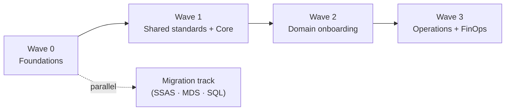

# 14. Roadmap & Migration

> `Owner Platform Owner` · `Status agreed` · `Depends on Strategy, Operating Model`

**Purpose** — sequence the build and plan any migration off legacy.

## The approach

Sequence the rollout in waves: foundations → shared standards → domain onboarding → operations. Domain
onboarding repeats per domain as a standing kit, so each new domain is a fast, templated entry rather
than a project. Where legacy exists, run migration as a parallel track, per source, by criticality.

The legacy stack is substantial: SSAS cube, MDS, on-prem SQL Server, and the on-prem Infor ION ERP
(cloud move ~2–3 years out). Migration runs per source, prioritised by business criticality. The Infor
ION cloud move is independent — the source-swappable ingestion layer (page 06) means it does not block
analytics delivery.

## Decisions

| Decision | Options | Choice | Why | Status |
|---|---|---|---|---|
| Rollout sequence | A1–A3 foundations → shared standards → domain onboarding → operations **Other** | foundations → shared standards → domain onboarding → operations (A1–A3) | each wave feeds the next; foundations must be solid before domain onboarding | agreed |
| Migration approach (if legacy) | A1 lift-and-shift / coexist A2 coexist-then-cutover per source A3 re-platform per domain **Other** | Coexist-then-cutover per source (A2) | SSAS + MDS + SQL de-risked individually; Infor ION cloud move independent | agreed |

## Migration tracker

| Legacy source | Approach | Target | Cutover | Status |
|---|---|---|---|---|
| SSAS cube | coexist-then-cutover | Direct Lake semantic model (sm-core) | wave 2 | proposed |
| MDS | coexist-then-cutover | lh-core-gold conformed dims + DQ framework | wave 1 | proposed |
| On-prem SQL Server | coexist-then-cutover | bronze → silver per domain lakehouse | wave 1–2 | proposed |
| On-prem Infor ION ERP | source-swappable bridge (page 06) | no change until cloud move (~2–3 yrs) | post wave 3 | proposed |

---
[← 13 Enablement](13-enablement-adoption.md) · [Manifest](../README.md)
