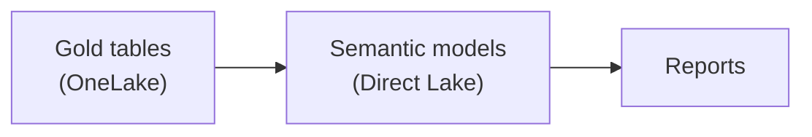

# 7. Transformation & Modelling

> `Owner Lead Architect` · `Status proposed` · `Depends on Architecture`

**Purpose** — decide where logic lives and how semantic models are built on top of the lake.

## The approach

Push transformation into the lake (silver/gold) and keep the semantic layer thin. Build on a **conformed
core** of shared dimensions and facts; let domains extend with composite models rather than re-deriving
the basics. Prefer Direct Lake so models read OneLake without import copies. Shape facts at a single
grain, reuse one dimension per role, and standardise the measure layer (base measures + calculation
groups + display folders) so consumers meet consistent, defensible numbers.

## Decisions

| Decision | Options | Choice | Why | Status |
|---|---|---|---|---|
| Modelling approach | A1 import star schemas A2 Direct Lake core; domain composite models A3 per-domain models on a certified core **Other** | _proposed_ | balance reuse against autonomy | proposed |
| Logic location | A1–A3 transform in silver/gold; thin semantic layer **Other** | _proposed_ | one place for logic, not scattered in DAX | proposed |
| Shared dimensions | A1 central A2 conformed core, domains extend A3 domain-published, federated **Other** | _proposed_ | consistency without a bottleneck | proposed || Aggregation / group-by placement | A1–A3 pre-aggregate in silver/gold where reused; model/DAX only for presentation-time **Other** | compute once, not per report | proposed |
| Fact grain & consolidation | A1 wide facts where simple A2 separate facts on conformed dims; merge only at identical grain A3 domain facts as products on conformed dims **Other** | avoid fan-out and wrong totals | proposed |
| Role-playing dimensions | A1–A3 single dim + inactive relationships + USERELATIONSHIP (no physical copies) **Other** | one dimension, reused across roles | proposed |
| Measure standards | A1 basic/ad-hoc measures A2 base measures + calculation groups + display folders A3 standardised measure layer + calculation groups, domain-owned **Other** | maintainable, consistent measures | proposed |
| Measure & object naming | A1–A3 agreed measure-naming + display-folder convention; business-friendly display names, technical names in git **Other** | consumer clarity | proposed |
---
[← 06 Ingestion](06-ingestion.md) · [Manifest](../README.md) · [Next: 08 Serving →](08-semantic-serving.md)
